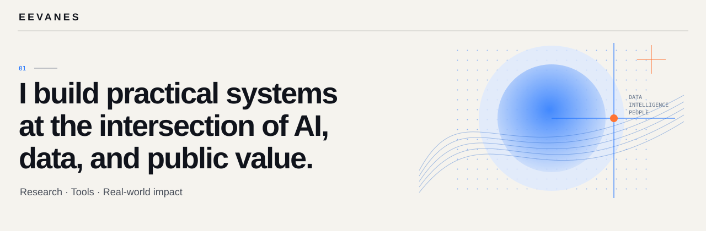

## Hello — I’m Evanes.

I build practical systems at the intersection of **AI, data, and public value**.

用数据与智能，理解复杂问题，构建真正可用的工具。

### Selected directions

- **[Accounting DataShare](https://accounting-datashare.vercel.app/)** — connecting accounting datasets, research cases, and analysis methods
- **[向善工坊 · AI Content System](https://my.feishu.cn/base/SPLsbFGGbaZVfFsLQ7pc52Mgnhe?from=from_copylink)** — a Feishu-based content workflow built with the China Foundation for Rural Development
- **Automated Report Review** — template-aware checks and editable review notes for Word, PDF, and scanned reports

### Currently exploring

Human-centered AI · Data products · Applied research

  <a href="https://eevanes.github.io/"><strong>Visit my personal homepage →</strong></a>
  &nbsp;&nbsp;·&nbsp;&nbsp;
  <a href="https://github.com/Eevanes?tab=repositories">Explore my repositories</a>
  &nbsp;&nbsp;·&nbsp;&nbsp;
  <a href="mailto:jiangweiyi0502@gmail.com">Email me</a>

---

Small tools. Larger possibilities.
